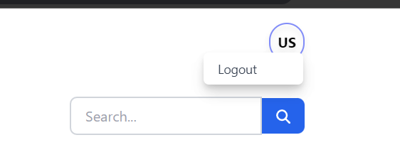

# TODO App Frontend

## 🧾 Description

- TODO App is web app helps user to create,read,update,delete todos basically perform CRUD operations

- This project is scaffolded using [vite](https://vitejs.dev/) react template

## 🛠 Installation and setup

> Run below commands in the terminal to see the app in the local system

- First clone the repositoy into your system `git clone git@github.com:aravindont/todo-frontend.git`

- Install all the necessary packages `npm install`

- Now run the command `npm run dev`

- Now open the url http://localhost:4002 to see the app up and running

## ⚙ Tools and Technologies used

- [React.js](https://react.dev/)
- [tailwind css](https://tailwindcss.com/)
- [fontawesome free react icons](https://fontawesome.com/v5/docs/web/use-with/react#contentHeader)
- [react router dom](https://reactrouter.com/en/main)
- [redux toolkit](https://redux-toolkit.js.org/)
- [redux](https://redux.js.org/)
- [react redux](https://react-redux.js.org/)
- [Appwrite](https://appwrite.io/)

## Pages

- home page (http://localhost:4002/)

- signup page (http://localhost:4002/signup)

- login page (http://localhost:4002/login)

- dashboard

## Modals

- Add Todo modal

- Add Task modal

- logout modal

## Appwrite to register and login the user

- Appwrite

  - Appwrite is an open-source platform for develop and manage backend of the applications.
  - It provides set of tools and functions those help developers to build severless application faster and more securely.

- Appwrite Auth console

## ✨ Features

Users creating the todos through this platform enjoys following features:

- [x] User can register
- [x] User can login
- [x] Todos will be created and shown on screen for logged in user
- [x] User authentication using Appwrite and localstorage.
- [x] User can create todo along with tasks
- [x] User can edit, delete,view todo title along with tasks
- [x] User can edit and delete tasks

## Backend API

[check here](https://github.com/aravindont/todo-backend)
